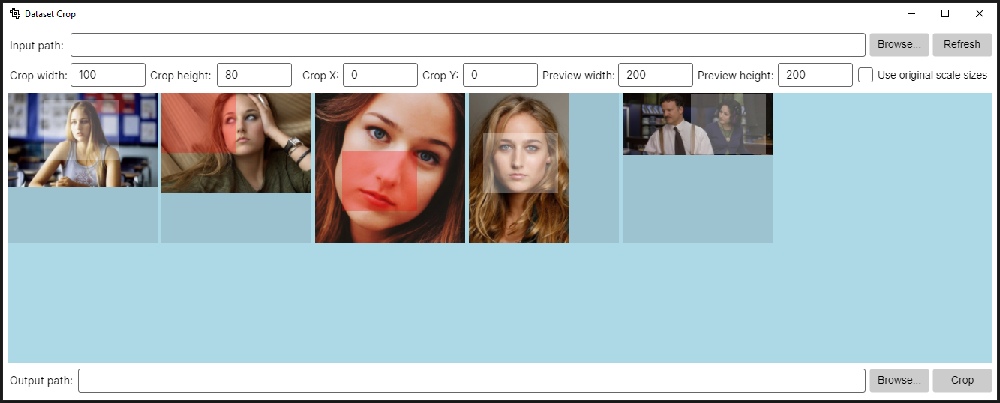

# Dataset Crop
Dataset Crop simplifies the crucial step of preparing image datasets for machine learning applications. This tool is essential when you need to crop multiple images to a specific resolution and/or aspect ratio, especially focusing on particular areas such as faces or objects. Dataset Crop streamlines the manual preparation process, setting the stage for efficient batch processing.



## Features

- **Batch Cropping**: Easily crop multiple images to a specified resolution or aspect ratio.
- **Focus Area Selection**: Manually select areas of interest (e.g., faces, objects) for precise cropping.
- **Preview Functionality**: View downscaled versions of images for quick cropping adjustments.
- **Draggable Crop Panels**: Intuitive UI with draggable panels for manually selecting of areas of interest (e.g., faces, objects) for precise cropping.
- **Aspect Ratio Preservation**: Automatically adjust images to maintain the aspect ratio during the crop.
- **Selection Toggle**: easily select or deselect which images to crop or not.
- **Original Encoding Preservation**: The cropped images are saved using the same image format as the input images.

## Running the Application

Dataset Crop was built using [Avalonia UI](https://avaloniaui.net/), so it is cross-platform and can be run on Linux, Windows, macOS. The process varies slightly depending on the operating system.

### Linux, macOS

1. Make sure you have the [.NET 7.0](https://dotnet.microsoft.com/en-us/download/dotnet/7.0) runtime installed. The process can differ based on your particular distro.
2. Open a terminal and navigate to the directory where the application is located.
3. Run the application using this command:
   ```bash
   dotnet DatasetCrop.dll
   ```
4. Depending on your Linux distribution, you might need to install additional dependencies. For instance, if you encounter issues related to `libSkiaSharp`, you might need to install specific libraries like `libice6`, `libsm6`, and `libfontconfig1`. These dependencies are required for `SkiaSharp`, which is used by Avalonia for rendering:
   ```bash
    sudo apt install libice6
    sudo apt install libsm6
    sudo apt install libfontconfig1
   ```

### Windows

1. Navigate to the directory where the application is located.
2. Double click the `DatasetCrop.exe` file to run the application.

## Usage

1. Launch the application.
2. For the **Input Path** field, browse and select the directory containing your images dataset, or manually paste the path in the text box.
3. Set the desired crop parameters:
   - **Use original scale sizes**: whether to use the original images sizes or the preview panel sizes to express the cropping parameters. 
   If this is checked, a value of 100 for **Crop Width** would literally mean 100 pixels of the original image. If it's unchecked, 
   it would mean 100 pixels of the scaled down preview panel. Example: for an image of 1000x1000 pixels, with a preview panel of 100x100 pixels,
   specifying a cropping width of 50 would mean half of the preview panel (50 = 100 / 2), which would translate to 500 pixels of the original image (1000 / (100 / 2)). 
   So, for short, this specifies whether to use "real life" pixels of the image, or the "scaled down" pixels of the preview, when cropping.
   - **Crop width**, **Crop height**: the width and height of the crop area, based on whether to use original scale sizes or not.
   - **Crop X**, **Crop Y**: the X and Y carthesian coordinates where the crop region should start, based on whether to use original scale sizes or not.
   - **Preview width**, **Preview height**: the width and height of the preview panels for images.
4. Press the **Refresh** button. At this moment, the previews of the images in the specified input directory will be displayed (or you will get a validation error, if some parameter is wrong).
5. Use the preview pane to adjust crop areas on each image. They can be positioned with the mouse.
6. Checking the **Selection mode** option and clicking on the crop area of images will toggle their "selected" state. This allows you to exclude images from the crop process. 
   Excluded images will turn their crop area preview's background to a semi-transparent red.
7. For the **Output Path** field, browse and select a directory where the cropped images will be saved, or manually paste the path in the text box.
8. Execute the batch crop process by clicking the **Crop** button.
9. The cropped images should be ready to be used in the training process. The input images are not modified in any way.

## Contributing

This software welcomes community contributions. All forms of input, be it code, bug reports, or feature suggestions, are appreciated.

## Acknowledgments and Credits

#### Icon

The application's icon was taken from [OnlineWebFonts](https://www.onlinewebfonts.com/icon/291810). It is licensed under [CC BY 4.0](https://creativecommons.org/licenses/by/4.0/).

#### Application type

The application was built using [Avalonia UI](https://avaloniaui.net/), for easy cross-platform deployment.

#### Image processing

The library used for image processing is [SixLabors ImageSharp](https://github.com/SixLabors/ImageSharp).

**I greatly appreciate the creators and contributors for providing these assets, packages and technologies.**

## License

This project is licensed under the GPLv3.0. See the [LICENSE](./documents/LICENSE.md) file for details.
